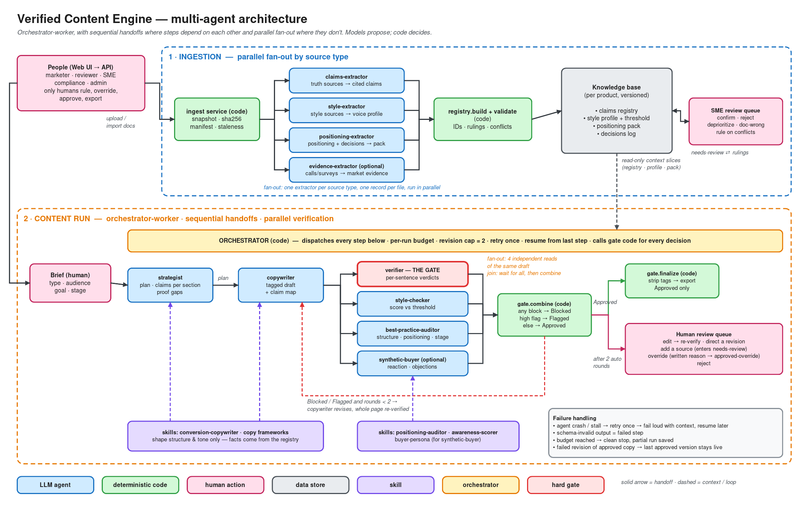

# Verified Content Engine: multi-agent architecture

**Repository:** https://github.com/danpereira88/verified-content-engine
**Diagram:** [`diagrams/multi-agent-architecture.excalidraw`](../diagrams/multi-agent-architecture.excalidraw) (PNG: [`multi-agent-architecture.png`](../diagrams/multi-agent-architecture.png))

## 1. The project and how the work decomposes

The system writes product-marketing content (landing pages, emails, one-pagers, FAQs) for any product and **blocks every factual sentence it can't trace to the product's own documentation**. Generic AI writers produce fluent copy with no idea what's true, and a single model that plans, writes and checks its own work is grading its own homework.

I split the work along **trust boundaries**, not just tasks:

| Piece | Why it's a separate unit |
|---|---|
| Extracting claims from docs | The only way facts enter the system. It needs one document at a time so quotes stay exact. |
| Extracting style, positioning and evidence | Different source types with different permissions: they may shape copy but can never create a fact. |
| Planning (strategist) | Chooses which verified claims go where before any prose exists, and lists proof gaps. |
| Writing (copywriter) | Creative work, constrained to tagged claims. |
| Verifying (the gate) | Must be independent of the writer: different context, no access to the writer's reasoning. |
| Style, best-practice and buyer checks | Independent opinions about the same draft. |
| Deciding, finalizing, retrying, budgeting | Must be reproducible, so it's done in code, not by a model. |

## 2. Architecture chosen: orchestrator-worker, with sequential handoffs and parallel fan-out

- **A code orchestrator** dispatches every step. It owns the budget, the revision cap and retries, and calls deterministic code for every decision.
- **Parallel fan-out in ingestion.** Four extractors run at once (claims, style, positioning, evidence), and claims extraction runs one document per call. A code join (`registry.build`) merges the results, allocates permanent claim IDs, re-applies past human rulings and detects conflicts.
- **A sequential handoff in generation.** The strategist hands to the copywriter, because the draft depends on the plan.
- **Parallel fan-out in verification.** The gate, style checker, best-practice auditor and synthetic buyer read the same draft simultaneously. A code join (`gate.combine`) turns their outputs into Blocked, Flagged or Approved.
- **A bounded loop.** If the draft is Blocked or Flagged with fewer than 2 revisions used, the copywriter revises from the flags and the whole page is re-verified. After that, a person decides.
- **Humans at the edges.** Only people confirm claims, rule on conflicts, override (with a written reason) and approve exports. Agents never do.

**Why this architecture:**

| Choice | Reason |
|---|---|
| Orchestrator in code, not an LLM | Status, revision and stop decisions must be reproducible and auditable. A model deciding "good enough" is exactly what the gate exists to prevent. |
| Separate writer and verifier | Self-review misses the writer's own overstatements. The verifier gets the draft and the claims, not the plan or the brief, and doesn't trust the writer's tags. |
| Parallel checkers | They are independent reads with no shared state, so running them together cuts latency without changing results. Isolation also stops a positive buyer reaction from softening the gate. |
| Per-document extraction | Small contexts keep quotes exact; thousands of claims don't fit well in one context. |
| Sequential strategist → copywriter | A real dependency. Planning first also surfaces proof gaps before anyone writes around them. |
| Revision cap + rollback | Revisions don't always converge: each fresh check can find new conflicts. A cap bounds cost; rollback keeps the last approved version live. |

**Alternatives considered:**
- **A single agent with all tools:** it grades its own work and overloads one context with the whole registry.
- **An agent team (peers talking freely):** hard to audit, and the writer could influence the verifier.
- **A fully sequential pipeline:** same results, slower.
- **An LLM orchestrator:** flexible, but the decisions that matter most would no longer be testable code.

## 3. Agents, skills and orchestrator

Every agent has a fixed output schema and a tool allowlist; anything not on the list is denied. Output that fails validation counts as a failed step. Full specifications: [`docs/agent-specs.md`](agent-specs.md). Definitions in code: `agents/<role>/agent.json` + `prompt.md`.

| Unit | Responsibility | Inputs | Context | Tools | Outputs | Depends on |
|---|---|---|---|---|---|---|
| **Orchestrator** (code) | Run pipelines, enforce budget, cap and retries, call gate code for decisions | Ingest or content-run request | Run state only, no model | Agent runtime, registry, gate, store | Run record: steps, rounds, cost, status | API, all agents |
| **claims-extractor** | Turn one truth document into atomic, cited claims | One doc snapshot | That doc only | read snapshot, write output | Claims with exact quote (<60 words), location, category, confidence | Ingest |
| **style-extractor** | Learn voice, cadence, vocabulary, naming | Style sources, decisions, measured stats | Style sources only, no truth docs | write output | Style profile + consistency check | Ingest |
| **positioning-extractor** | Build positioning, personas, objections, stages | Positioning sources, decisions | Sources + verbatim decisions | search registry, write output | Positioning pack; proof points marked has-claim or needs-claim | Ingest, registry |
| **evidence-extractor** (optional) | Market evidence with reproducible counts | Anonymized survey data | Evidence only | write output | Counted claims (code re-counts them), buyer phrases; no names | Ingest |
| **strategist** | Plan framework, angle, persona, outline, claims per section | Brief, pack, registry slice | Brief + pack + verified claims | search registry, get claim, write output | Plan + proof gaps | Knowledge base ready |
| **copywriter** | Write the tagged draft; revise from flags or human instructions | Plan, style profile, claims, flags | Plan + profile + claims | get claim, search registry, write output | Tagged draft, claim map, missing claims | Strategist |
| **verifier (the gate)** | Per-sentence verdict: pass / block / flag, with a reason code | Draft units, cited and related claims | Draft + claims only, never the plan or brief | get claim, search registry, read snapshot, write output | Gate verdicts + page-level checks | Copywriter |
| **style-checker** | Score the draft against the profile | Draft, profile, threshold | Same | write output | Score + flags | Copywriter |
| **best-practice-auditor** | Check structure, CTA, positioning fit, awareness stage | Draft, plan, pack | Same | write output | Scores + flags | Copywriter |
| **synthetic-buyer** (optional) | React as the buyer persona | Draft with tags stripped, persona | Same | write output | Verdict, objections, missing proof | Copywriter |
| **Skill: conversion-copywriter** | Frameworks, headlines, CTAs | — | Loaded into strategist and copywriter | — | Shapes structure and tone only | — |
| **Skills: positioning-auditor, awareness-scorer** | Positioning and stage judgment | — | Loaded into best-practice-auditor | — | Judgment only | — |
| **Skill: buyer-persona** | Role-play rules | — | Loaded into synthetic-buyer | — | Can't invent facts to answer its own objections | — |

Skills are treated as **untrusted for facts**. If a skill states a product fact the registry lacks or contradicts, it is flagged, and the copy follows the registry.

## 4. Handoffs

| # | From → To | Payload | Mode |
|---|---|---|---|
| H1 | Person → orchestrator | Ingest request for a product | — |
| H2 | Orchestrator → 4 extractors | One source type each; claims: one doc per call | **Parallel** |
| H3 | Extractors → `registry.build` (code) | Per-document records | **Join**: wait for all; failed docs reported |
| H4 | Registry → reviewer queue | Needs-review claims, conflicts | Async, human |
| H5 | Brief → strategist | Brief, positioning pack, registry slice | Sequential |
| H6 | Strategist → copywriter | Plan | Sequential |
| H7 | Copywriter → 4 checkers | The same draft version | **Parallel** |
| H8 | Checkers → `gate.combine` (code) | Verdicts, scores, flags | **Join** |
| H9 | `gate.combine` → copywriter | Flags, while revisions used < 2 | Loop |
| H10 | `gate.combine` → finalize or human review | Status + report | Branch |

**How results combine.** `gate.combine` is plain code:
- any blocked sentence → **Blocked**;
- otherwise, any high-severity flag → **Flagged**;
- otherwise → **Approved**.

Code also applies mechanical rules on top of the verifier. A sentence citing a claim that is missing, deprecated or still needs review is blocked, even if the model passed it. A logged human override with a written reason gives **Approved (override)**, never plain Approved.

**When an agent fails:**

| Failure | Behavior |
|---|---|
| Agent crashes, stalls or returns invalid output | Retry once with the same input, then fail the run loudly with context; resume later from the last completed step |
| One document's extraction fails | That doc is marked `extraction-failed`; the rest continue |
| Gate result missing | Never treated as a pass: Blocked |
| Style checker or best-practice auditor fails | High-severity flag, so the draft can't be auto-approved |
| Synthetic buyer fails | Optional: the run continues and the report notes it |
| Budget reached | Clean stop before the next step; state saved |
| A revision of approved copy fails | The approved version stays live; the failed round is archived |

## 5. Implementation

The core workflow is fully implemented in Python (standard library only) with a web UI. Agents run on Claude through a tool-use loop with per-role tool allowlists, or on a deterministic offline baseline so the whole system runs and is testable without an API key.

| Area | Where |
|---|---|
| Orchestrator (pipelines, retries, budget, revision loop, resume) | `services/orchestrator` |
| Agent definitions, runtime, providers | `agents/` |
| Deterministic gate decisions | `packages/gate` |
| Registry, permanent IDs, rulings, conflicts | `packages/registry` |
| Schemas for every artifact | `packages/schemas` |
| API, roles, workspace isolation | `services/api`, `services/store` |
| Web UI | `apps/web` |
| Evals and tests | `evals/`, `tests/` (84 tests) |

**Results on two invented products** (offline baseline; targets in brackets):

| | Hallucination catch (≥95%) | False blocks (≤10%) | Untagged facts caught (≥95%) |
|---|---|---|---|
| Lumen Hub (rules tuned on it) | 98.6% | 6.1% | 100% |
| Shiftwell (held out) | 97.3% | 9.1% | 100% |

Both products have planted traps:
- a beta-vs-GA conflict between pages
- an absolute claim with a documented exception
- two pages giving different numbers
- high-risk compliance claims
- facts that, read together, imply something unstated

Conflict detection finds all of them. In end-to-end runs, drafts are blocked in round 1, then approved after a revision or handed to a person after two. The next step is to confirm the gate numbers with the Claude-backed verifier. Details and limits: [`docs/implementation.md`](implementation.md).

**Run it:** `bin/demo ~/vce-demo-data`, then `VCE_DATA_DIR=~/vce-demo-data bin/vce serve`, and open http://127.0.0.1:8780.
